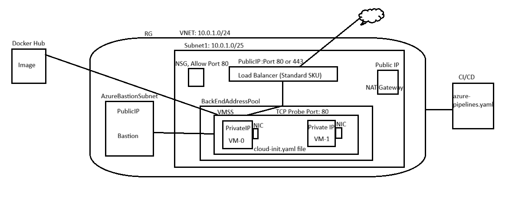

# Terraform

1. Created an App registration in azure portal and assigned Contributor access so Terraform can create and manage Azure resources.
2. Created images and pushed to docker hub.
   Used Dockerhub to build and push image. \
   Commands: \
   docker login \
   docker build -t sreenija4363/nginx-image:latest . \
   docker push sreenija4363/nginx-image:latest 
3. Created terraform configurations files to provision RG, VNET, Subnet, NSG, Load Balancer, NAT Gateway and VMSS.
4. Basic Nginx application running on port 80. \
   

Modules used in Terraform: 
1. RG: Resource group module 
2. Network: Used to create resources- Vnet, Subnet, NSG (associated with subnet), NSG rule to open port 80 for Azure Load balancer, NAT Gateway (for outbound internet connectivity to install packages), PublicIP for NAT Gateway  and associated NAT Gateway with subnet. 
3. VMSS: Used to create VMSS resource, Private Pemkey for authentication. Bastion.tf configuration file to create bastion resource to connect to VMSS instances. Bastion Subnet, Bastion Public IP address. 
4. LoadBalancer: Used to create PublicIP for LB, LoadBalancer resources. 

Files: \
Docker folder: Contains DockerFile and index.html files. \
Images folder: Contains images. \
remotebackend.tf: Azure Storage Container Blob backend configuration. \
modules\VMSS\cloud-init.yaml: Script to install Docker inside vmss instances and pull image from Docker Hub.

Architecture Flow:

Cost estimations: \
Used Azure Cloud. I have experience working with Azure services. Bastion with a Public IP costs around 138 AUD. We can uninstall Bastion once we verify the application. The estimated overall cost for all resources is around 95 AUD. Azure NAT Gateway also costs more because it requires a Public IP. We can reduce the cost by using a Load Balancer outbound rule instead of a NAT Gateway. With this change, the cost can be reduced to approximately 60 AUD.

Commands to execute project: 

terraform init \
terraform plan -out=tfplan \
terraform apply tfplan 

