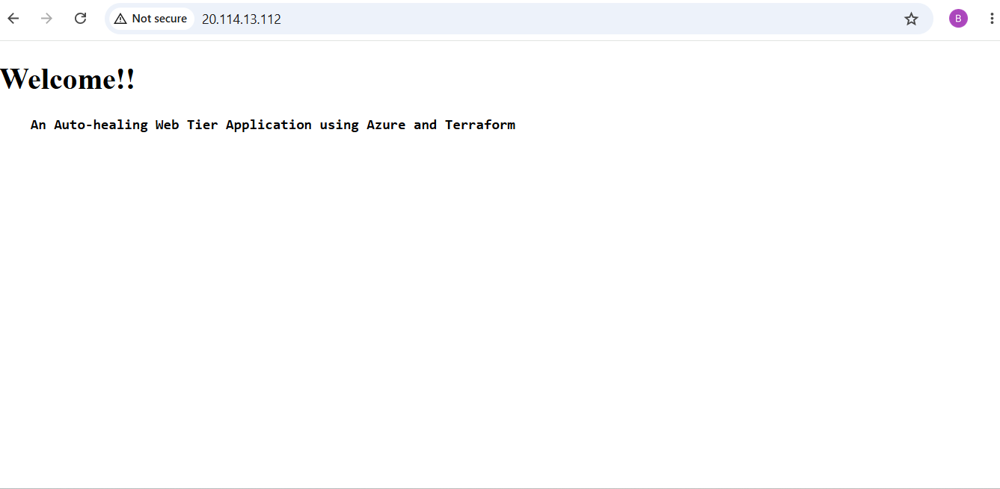

<<<<<<< HEAD
# Terraform

1. Create App registration in azure portal and provide Contributor access to create and manage Azure resources.
2. Create images and push to docker hub.
   Used Dockerhub to build and push image. \
   Commands: \
   docker login \
   docker build -t sreenija4363/nginx-image:latest . \
   docker push sreenija4363/nginx-image:latest 
3. Create terraform configuration files to provision RG, VNET, Subnet, NSG, Load Balancer, NAT Gateway, VMSS.
4. Basic Nginx application running on port 80. \
   

=======
Azure Terraform Project
>>>>>>> master
